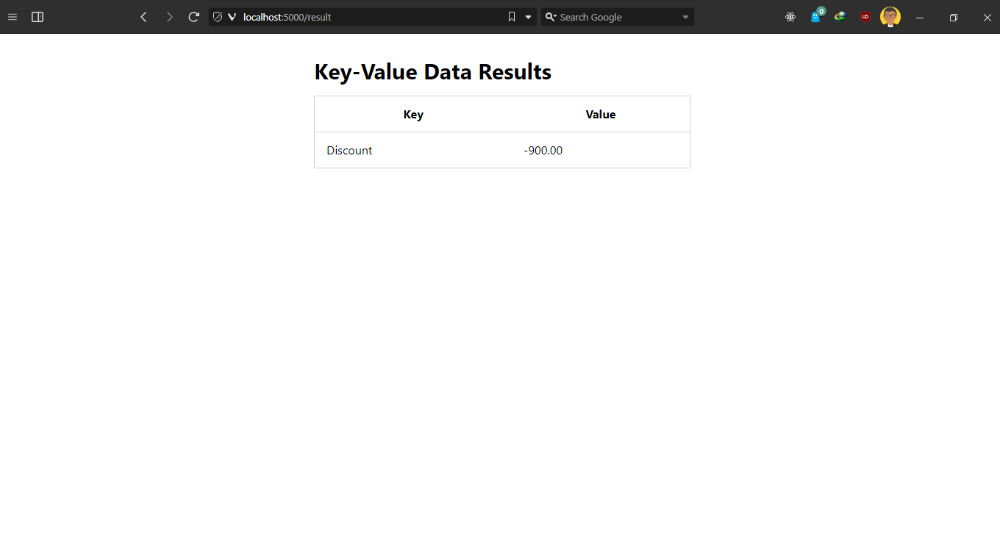

# Research

# Selection options
1. [PyMuPDF](https://github.com/pymupdf/PyMuPDF)
    Pros
    1. Recent Github activity; commits + closed issues + closed pull requests
    2. Github popularity; 2.6k Stars + 325 Forks
    3. Integrates Google Tesseract Engine for Optical Character Recognition (OCR)
    4. File conversions, to and from Pdf or other formats
    5. Wide range of support for working with text, images, drawings, shape objects, forms in pdf files
    6. Multiprocessing

    Cons
    1.  Extracting from a table in pdf files

    Unknowns
    1. Batch processing of files
    2. Async operations

2. [PyTesseract](https://github.com/madmaze/pytesseract)
    Pros
    1. Recent Github activity; commits + closed issues + closed pull requests
    2. Github popularity; 4.9k Stars + 659 Forks
    3. Wraps around Google Tesseract Engine for Optical Character Recognition (OCR)
    4. File output conversions, to and from Pdf or other formats
    5. Language setting

    Cons
    1.  ??

    Unknowns
    1. Batch processing of files
    2. Multiprocessing
    3. Async operations

3. [Textract](https://github.com/deanmalmgren/textract)
    Pros
    1. Wide range of file support
    2. Github popularity; 3.5k Stars + 528 Forks
    3. Uses Google Tesseract Engine for Optical Character Recognition (OCR)
    4. Works with video, audio, doc files
    5. Language setting

    Cons
    1. Minimal recent Github activity; commits + closed issues + closed pull requests

    Unknowns
    1. Batch processing of files
    2. Multiprocessing
    3. Async operations

4. [PdfMiner.Six](https://github.com/pdfminer/pdfminer.six/)
    Pros
    1. Available in Command line 
    2. Github popularity; 4.6k Stars + 834 Forks
    3. Wide range of support for working with text, shape objects, images in pdf files
    4. File output generation, to and from Pdf or other formats

    Cons
    1. Minimal recent Github activity; commits + closed issues + closed pull requests
    2. Extracting from a table in pdf files

    Unknowns
    1. Batch processing of files
    2. Multiprocessing
    3. Async operations

5. [PdfPlumber](https://github.com/jsvine/pdfplumber)
    Pros
    1. Recent Github activity; commits + closed issues + closed pull requests
    2. Github popularity; 4k Stars + 504 Forks
    3. Wide range of support for working with text, lines, shape objects, images, tables, forms in pdf files
    4. Visual debugging using ImageMagick implementation
    5. Pdf file/single page conversion to image

    Cons
    1. Works with pdf files only
    2. Does not support Optical Character Recognition (OCR)
    3. Generating a pdf file from another format

    Unknowns
    1. Batch processing of files
    2. Multiprocessing
    3. Async operations

6. [PyPdf](https://github.com/py-pdf/pypdf)
    Pros
    1. Recent Github activity; commits + closed issues + closed pull requests
    2. Github popularity; 5.8k Stars + 1.2k Forks
    3. Wide range of support for working with text and metadata in pdf files

    Cons
    1. Works with pdf files only
    2. Extracting from a image, table, shape objects in pdf files
    3. Does not support Optical Character Recognition (OCR)

    Unknowns
    1. Batch processing of files
    2. Multiprocessing
    3. Async operations

# Setup
``` python
# Install Tesseract OCR engine
sudo apt install -y tesseract-ocr
sudo apt install -y libtesseract-dev

# Setup virtual enviroment
python3 -m venv .venv

# Activate the virtual environment
. ./.venv/bin/activate

# Upgrade pip to the latest version
pip install --upgrade pip

# Install the python packages
pip install -r requirements.txt

# Running the app
python3 app.py
```

# Challenges
- Flask uploads doesn't seem to work correctly and gives an error message about werkzeug
```
ImportError: cannot import name 'secure_filename' from 'werkzeug' 
```
Solution: Decided to use file type extensions instead of trying another module like flask-Reuploaded

- OCR conversion
```
Couldn't get PymuPDF to utilize the tesseract OCR engine and fell short in handling documents that required OCR
```
Solution: imported pytesseract which wraps around the tesseract engine to handle OCR file processing

# Screenshots



# Video
<video src='./content/Video_1.mp4' width=180 />
